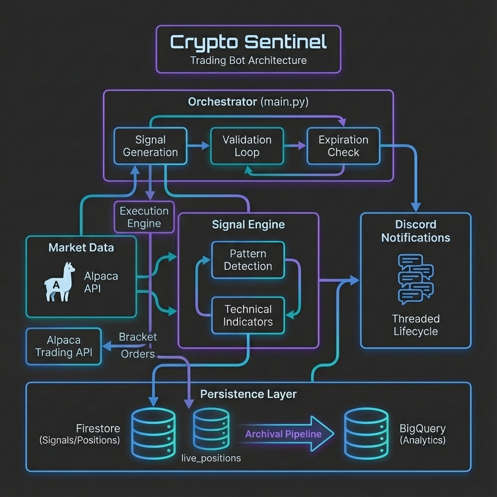

[](https://github.com/lagarcess/crypto-signals/actions/workflows/deploy.yml)


# Crypto Sentinel

**Automated cryptocurrency and equity trading signal generator with cloud-native architecture.**

## Overview

Crypto Sentinel is a production-ready trading bot that:

- 📊 Ingests market data for stocks and cryptocurrencies via Alpaca API
- 🔍 Analyzes technical indicators and patterns using confluence logic
- 🚀 Generates trading signals with risk management parameters
- ⚡ **Executes trades via Alpaca Bracket Orders** (Entry, Take-Profit, Stop-Loss)
- 🤖 Automated execution with managed trade lifecycle and broker sync
- 📊 PnL tracking for closed positions
- 💬 Sends real-time Discord notifications
- ☁️ Stores signals and positions in Google Cloud Firestore
- 📈 Archives trade history to BigQuery for analytics

## Features

### Core Capabilities

- **Multi-Asset Support**: Trades both cryptocurrencies (BTC, ETH, XRP) and equities (NVDA, QQQ, GLD)
- **Pattern Recognition**: Detects 28 patterns using O(N) ZigZag pivot detection, including candlestick reversal patterns (Hammer, Engulfing, Morning Star), structural chart patterns (Bull Flag, Double Bottom, Cup and Handle), and Fibonacci harmonic patterns (Gartley, Bat, Butterfly, Crab, ABCD, Elliott Wave)
- **Technical Indicators**: RSI, MACD, Bollinger Bands, EMA, and more
- **Account Snapshot Pipeline**: Daily capture of account state, including extended risk metrics (Buying Power, Margin) and performance calculation (Drawdown, Calmar Ratio).
- **Risk Management**: Automatic stop-loss calculation and position sizing
- **Cloud-Native**: Designed for containerized deployment on GCP

### Discord Notifications

- ✅ **Threaded Signal Lifecycle**: All updates (TP hits, invalidations, expirations) are pinned to a single thread
- ✅ **Self-Healing**: Orphaned signals automatically create new threads for future updates
- ✅ **Visual Integration Tests**: Real webhook testing with `scripts/visual_discord_test.py`

### Production Features

- ✅ **Secret Management**: Google Secret Manager integration
- ✅ **Rate Limiting**: Automatic throttling to respect API limits (200 req/min)
- ✅ **Retry Logic**: Exponential backoff for transient failures
- ✅ **Graceful Shutdown**: SIGTERM/SIGINT handling for clean container stops
- ✅ **Execution Gating**: Strict `ENVIRONMENT=PROD` requirement for Alpaca order placement; results are logged as `[THEORETICAL MODE]` in `DEV`.
- ✅ **Environment Isolation**: Automatic data routing to environment-specific Firestore collections (`live_` vs `test_`).
- ✅ **Data Cleanup**: Automatic TTL via Firestore (30/7-day retention for signals, 90-day for positions).
- ✅ **State Reconciliation**: Automatic detection and healing of sync gaps between Alpaca and Firestore (Issue #113):
  - Detects **Zombies**: Positions marked OPEN in Firestore but already closed in Alpaca
  - Detects **Orphans**: Positions open in Alpaca but missing from Firestore (manual entries)
  - Heals zombies by marking them `CLOSED_EXTERNALLY` + Firestore update
  - Alerts orphans via Discord for manual investigation
  - Runs automatically at job startup, non-blocking, PROD-gated
- ✅ **Zombie Signal Prevention**: Two-phase commit ensures database tracking before Discord notification, with automated compensation for failures.
- ✅ **Docker Support**: Multi-stage builds with security best practices

### Automated Execution

- ⚡ **Bracket Orders**: Atomic Entry + Take-Profit + Stop-Loss via Alpaca API
- 📏 **Risk-Based Position Sizing**: `qty = RISK_PER_TRADE / |entry - stop|`
- 🔐 **Dual Safety Guards**: Requires `ALPACA_PAPER_TRADING=True` AND `ENABLE_EXECUTION=True`
- 🔗 **Signal-to-Position Traceability**: `signal_id` used as `client_order_id`
- 💾 **Position Persistence**: Live positions stored in `live_positions` Firestore collection

### Order Management (Managed Trade Model)

- 🔄 **Position Sync**: Real-time synchronization with Alpaca broker state
- 📊 **Leg Management**: Track TP/SL order IDs for targeted operations
- 📈 **Trailing Stops**: Replace stop-loss orders via `modify_stop_loss()`
- 🚨 **Emergency Close**: Cancel all legs and exit at market price
- 🎯 **Slippage Analysis**: Track `target_entry_price` vs actual fill for analytics

## Architecture



**Core Engine:**

- **Structural Foundation**: O(N) ZigZag pivot detection with Numba JIT compilation
- **Pattern Classification**: STANDARD_PATTERN (5-90d) vs MACRO_PATTERN (>90d)
- **Shadow Signaling**: Rejected signals persisted to `rejected_signals` collection for audit

**External Services:**

- **Alpaca API**: Market data & trading
- **Google Cloud Firestore**: Signal, position, and rejected signal storage
- **Google Cloud BigQuery**: Trade analytics
- **Discord Webhooks**: Threaded notifications
- **Google Secret Manager**: Credentials

## Project Structure

```
crypto-signals/
├── src/crypto_signals/
│   ├── main.py                    # Application entrypoint
│   ├── config.py                  # Configuration management
│   ├── secrets_manager.py         # Secret Manager integration
│   ├── observability.py           # Structured logging & metrics
│   ├── engine/
│   │   ├── signal_generator.py    # Signal generation orchestration
│   │   └── execution.py           # Alpaca order execution & management
│   ├── market/
│   │   ├── data_provider.py       # Alpaca API wrapper
│   │   └── exceptions.py          # Custom exceptions
│   ├── analysis/
│   │   ├── indicators.py          # Technical indicators (RSI, MACD, etc.)
│   │   ├── structural.py          # O(N) ZigZag pivot detection (Numba JIT)
│   │   ├── harmonics.py           # Fibonacci harmonic pattern detection
│   │   └── patterns.py            # Candlestick and chart pattern detection
│   ├── notifications/
│   │   └── discord.py             # Discord webhook client (threaded messaging)
│   ├── repository/
│   │   └── firestore.py           # Firestore persistence layer
│   ├── pipelines/
│   │   ├── base.py                # BigQuery pipeline base
│   │   ├── trade_archival.py      # Trade archival pipeline
│   │   └── account_snapshot.py    # Account snapshot pipeline
│   └── domain/
│       └── schemas.py             # Pydantic data models
├── scripts/
│   ├── visual_discord_test.py     # Visual Discord integration tests
│   └── verify_firestore_config.py # Firestore configuration verification
├── docs/
│   ├── discord-threading.md       # Discord threading documentation
│   └── images/                    # Architecture diagrams
│       ├── crypto-sentinel-architecture.png
│       └── signal-lifecycle-architecture.png
├── tests/                         # Comprehensive test suite
├── Dockerfile                     # Multi-stage production build
├── docker-compose.yml             # Local development setup
├── DEPLOYMENT.md                  # Quick-start deployment guide
├── pyproject.toml                 # Poetry dependencies
└── README.md                      # This file
```

## Quick Start

### Prerequisites

- Python 3.9+
- Poetry (dependency management)
- Docker (optional, for containerized deployment)
- Google Cloud Project (for production deployment)
- Alpaca API credentials
- Discord webhook URL

### Local Development Setup

1. **Clone the repository**:

   ```bash
   git clone https://github.com/lagarcess/crypto-signals.git
   cd crypto-signals
   ```

2. **Install dependencies**:

   ```bash
   poetry install
   ```

3. **Configure environment**:
   Create a `.env` file in the project root:

   ```env
   # Alpaca API
   ALPACA_API_KEY=your_api_key
   ALPACA_SECRET_KEY=your_secret_key
   ALPACA_PAPER_TRADING=true

   # Google Cloud
   GOOGLE_CLOUD_PROJECT=your-gcp-project-id
   GOOGLE_APPLICATION_CREDENTIALS=./path/to/service-account.json

   # Discord Webhooks (Multi-destination Routing)
   # Test webhook - always required (used for dev/test and system messages)
   TEST_DISCORD_WEBHOOK=https://discord.com/api/webhooks/your-test-webhook
   TEST_MODE=true  # When true, all traffic goes to test webhook (safe default)

   # Production webhooks (uncomment when TEST_MODE=false)
   # LIVE_CRYPTO_DISCORD_WEBHOOK_URL=https://discord.com/api/webhooks/crypto-channel
   # LIVE_STOCK_DISCORD_WEBHOOK_URL=https://discord.com/api/webhooks/stock-channel

   # Optional
   RATE_LIMIT_DELAY=0.5  # Seconds between API requests

   # Execution Engine (Paper Trading Only)
   ENABLE_EXECUTION=false      # Set to true to submit orders
   RISK_PER_TRADE=100.0        # Fixed dollar risk per trade
   ```

4. **Run health check**:

   ```bash
   poetry run python -m crypto_signals.scripts.health_check
   ```

5. **Run the bot**:
   ```bash
   poetry run python -m crypto_signals.main
   ```

### Docker Setup

1. **Build the image**:

   ```bash
   docker build -t crypto-signals:latest .
   ```

2. **Run with Docker Compose**:

   ```bash
   # Create secrets directory and add GCP key
   mkdir -p secrets
   cp /path/to/service-account.json secrets/gcp-key.json

   # Start the service
   docker-compose up
   ```

## Configuration

### Environment Variables

| Variable                          | Required | Default | Description                                                       |
| --------------------------------- | -------- | ------- | ----------------------------------------------------------------- |
| `ALPACA_API_KEY`                  | Yes      | -       | Alpaca API key                                                    |
| `ALPACA_SECRET_KEY`               | Yes      | -       | Alpaca secret key                                                 |
| `ALPACA_PAPER_TRADING`            | No       | `true`  | Use paper trading account                                         |
| `GOOGLE_CLOUD_PROJECT`            | Yes      | -       | GCP project ID                                                    |
| `GOOGLE_APPLICATION_CREDENTIALS`  | No\*     | -       | Path to service account JSON (\*auto in cloud)                    |
| `TEST_DISCORD_WEBHOOK`            | Yes      | -       | Discord webhook for test/dev messages                             |
| `TEST_MODE`                       | No       | `true`  | Route all traffic to test webhook (safe default)                  |
| `LIVE_CRYPTO_DISCORD_WEBHOOK_URL` | No\*\*   | -       | Live webhook for CRYPTO signals (\*\*required if TEST_MODE=false) |
| `LIVE_STOCK_DISCORD_WEBHOOK_URL`  | No\*\*   | -       | Live webhook for EQUITY signals (\*\*required if TEST_MODE=false) |
| `DISCORD_SHADOW_WEBHOOK_URL`      | No       | -       | Deduplicated shadow signals (rejected patterns)                   |
| `RATE_LIMIT_DELAY`                | No       | `0.5`   | Delay between API requests (seconds)                              |
| `DISABLE_SECRET_MANAGER`          | No       | `false` | Disable Secret Manager (local dev)                                |
| `ENABLE_EXECUTION`                | No       | `false` | Enable bracket order execution                                    |
| `ENABLE_EQUITIES`                 | No       | `false` | Enable stock trading (requires Alpaca SIP data plan)              |
| `RISK_PER_TRADE`                  | No       | `100.0` | Fixed dollar amount to risk per trade                             |

### Portfolio Configuration

Edit `config.py` to customize the symbols to analyze:

```python
CRYPTO_SYMBOLS: List[str] = [
    "BTC/USD",
    "ETH/USD",
    "XRP/USD",
]

EQUITY_SYMBOLS: List[str] = [
    "NVDA",
    "QQQ",
    "GLD",
]
```

## Deployment

### Quick Start

See [DEPLOYMENT.md](DEPLOYMENT.md) for a 5-minute quick-start deployment guide for experienced users.

### Comprehensive Documentation

For detailed step-by-step deployment instructions, see:

- **[GCP Deployment Guide](docs/GCP_DEPLOYMENT_GUIDE.md)** - Complete production deployment guide including:
  - Service account configuration
  - Secret Manager setup with permission granting
  - Cloud Scheduler setup for daily 00:01 UTC execution
  - All environment variables and GitHub configuration
  - Complete verification procedures

- **[Troubleshooting Guide](docs/TROUBLESHOOTING.md)** - Common errors and solutions:
  - Permission denied on secrets
  - Missing environment variables
  - Boolean parsing errors
  - Invalid scheduler URI
  - Debugging commands and log viewing

## Development

### Running Tests

```bash
# Run all tests
poetry run pytest

# Run with coverage
poetry run pytest --cov=crypto_signals

# Run specific test file
poetry run pytest tests/test_main.py
```

### Code Quality

```bash
# Format code
poetry run ruff format src/ tests/

# Lint code
poetry run ruff check src/ tests/

# Type checking
poetry run mypy src/
```

### Pre-commit Hooks

```bash
# Install pre-commit hooks
poetry run pre-commit install

# Run manually
poetry run pre-commit run --all-files
```

### Pre-Push Hook (Recommended)

**Automatically runs tests before every push** to prevent CI failures.

The pre-push hook is already installed in `.git/hooks/` and will run automatically:

```bash
git push  # Tests run automatically before push
```

**Output:**

```
🔍 Running pre-push validation...
📋 Running unit tests...
237 passed, 13 deselected in 26.33s
✅ All tests passed - Proceeding with push
```

**Benefits:**

- ✅ Catches test failures before they hit CI (~5 min saved per failure)
- ✅ Runs in ~30 seconds locally vs ~3-5 minutes in CI
- ✅ Prevents embarrassing CI failures

**To bypass (emergency only):**

```bash
git push --no-verify
```

> [!NOTE]
> See the [Pre-Push Hook Guide](./docs/PRE_PUSH_HOOK.md) for troubleshooting and customization.

### Visual Discord Tests

Test signal threading and formatting with real Discord messages:

```powershell
# Ensure TEST_DISCORD_WEBHOOK is set in .env, then:
poetry run python scripts/visual_discord_test.py success      # Signal → TP1 → TP2 → TP3
poetry run python scripts/visual_discord_test.py invalidation # Signal → Invalidation
poetry run python scripts/visual_discord_test.py expiration   # Signal → Expiration
poetry run python scripts/visual_discord_test.py trail        # Runner trail path
poetry run python scripts/visual_discord_test.py patterns     # 8 structural patterns
poetry run python scripts/visual_discord_test.py harmonic     # Harmonic pattern with ratios
poetry run python scripts/visual_discord_test.py all          # Run all paths

# Test live mode routing (requires LIVE_CRYPTO_DISCORD_WEBHOOK_URL)
poetry run python scripts/visual_discord_test.py all --mode live
```

These tests verify that all lifecycle updates appear in a single thread.

## Security Considerations

1. **Never commit secrets**: Use `.env` locally and Secret Manager in production
2. **Non-root container**: Dockerfile runs as user `appuser` (UID 1000)
3. **Minimal base image**: Uses `python:3.11-slim` for reduced attack surface
4. **Secret rotation**: Rotate API keys and webhooks regularly
5. **IAM least privilege**: Grant only necessary permissions to service accounts

## Monitoring & Observability

### Structured Logging

All operations include contextual information:

```
2024-01-15 10:30:45 - crypto_signals.main - INFO - Analyzing BTC/USD | symbol=BTC/USD | asset_class=CRYPTO
2024-01-15 10:30:47 - crypto_signals.main - INFO - Completed: signal_generation | duration=2.34s | symbol=BTC/USD
```

### Metrics Collection

Built-in metrics tracking:

- Success/failure rates per operation
- Execution duration (min/avg/max)
- Total operations count
- Error rates and types

### Shadow Signals (Phase 7)

Rejections are routed to `#shadow-signals` (grey embed) and stored in `rejected_signals` collection.
Key metrics captured in `confluence_snapshot`: RSI, ADX, SMA trend, Volume Ratio.

**Firestore Indexing:**
Ensure composite index exists for `rejected_signals`:
`symbol ASC, rejected_at DESC`
(Required for Phase 8 audit queries)

### Health Checks

Run health checks to verify connectivity:

```bash
poetry run python -m crypto_signals.scripts.health_check
```

Verifies:

- ✅ Alpaca Trading API
- ✅ Alpaca Market Data API
- ✅ Google Cloud Firestore
- ✅ Google Cloud BigQuery
- ✅ Discord Webhook

## Troubleshooting

For comprehensive troubleshooting of deployment and runtime issues, see the **[Troubleshooting Guide](docs/TROUBLESHOOTING.md)** which covers:

- Permission denied on secrets
- Missing environment variables
- Boolean parsing errors
- Cloud Scheduler configuration issues
- CI/CD deployment failures
- Debugging commands and log viewing

### Common Local Issues

#### Rate Limit Errors

Increase `RATE_LIMIT_DELAY`:

```env
RATE_LIMIT_DELAY=1.0  # Increase from default 0.5s
```

#### Memory Issues

Reduce portfolio size or increase container memory:

```bash
docker-compose up --scale crypto-signals=1 --memory=2g
```

#### Secret Loading Failures

Check Secret Manager permissions:

```bash
gcloud projects get-iam-policy $GOOGLE_CLOUD_PROJECT
```

## Contributing

1. Fork the repository
2. Create a feature branch: `git checkout -b feature/amazing-feature`
3. Commit your changes: `git commit -m 'Add amazing feature'`
4. Push to the branch: `git push origin feature/amazing-feature`
5. Open a Pull Request

## License

This project is licensed under the MIT License - see the LICENSE file for details.

## Acknowledgments

- [Alpaca Markets](https://alpaca.markets/) for market data and trading API
- [pandas-ta](https://github.com/twopirllc/pandas-ta) for technical indicators
- Google Cloud Platform for infrastructure services

## Support

For issues, questions, or contributions, please open an issue on GitHub.

---

**⚠️ Disclaimer**: This software is for educational purposes only. Cryptocurrency and stock trading involves substantial risk of loss. Use at your own risk.
