# Pattern Reference Guide

This document provides a comprehensive reference for all bullish candlestick patterns and chart patterns detected by the Sentinel Trader signal engine.

## Table of Contents

- [Pattern Overview](#pattern-overview)
- [Single-Candle Patterns](#single-candle-patterns)
- [Two-Candle Patterns](#two-candle-patterns)
- [Three-Candle Patterns](#three-candle-patterns)
- [Multi-Day Chart Patterns](#multi-day-chart-patterns)
- [Confluence Factors](#confluence-factors)
- [Signal Quality Filters](#signal-quality-filters)

---

## Pattern Overview

The signal engine detects **22 bullish patterns** organized into four categories based on their formation duration and complexity.

| Category | Pattern Count | Detection Method |
|----------|---------------|------------------|
| Single-Candle | 5 | Shape analysis |
| Two-Candle | 5 | Sequential comparison |
| Three+ Candle | 4 | Multi-bar validation |
| Multi-Day Chart | 6 | Geometric/structural |

All patterns use **vectorized pandas operations** for high performance processing on large datasets.

---

## Single-Candle Patterns


### Bullish Hammer


A reversal pattern that forms at the bottom of a downtrend, signaling potential buying pressure.

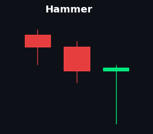

**Detection Logic:**
- Lower wick ≥ 2× body size
- Upper wick < 30% of total range
- Body in upper 30% of candle range

**Confluence Requirements:**
- RSI < 45 (oversold-ish)
- Volume > 120% of 20-period SMA
- Volatility contraction (ATR < SMA)
- RSI bullish divergence OR price below EMA 50

---

### Inverted Hammer


A bullish reversal pattern with a long upper shadow, indicating failed selling pressure.

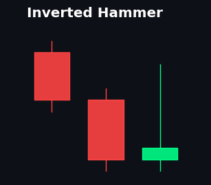

**Detection Logic:**
- Upper wick ≥ 2× body size
- Lower wick < 30% of total range
- Body in lower 30% of candle range

**Confluence Requirements:**
- Reversal context (RSI divergence OR momentum oversold)
- Volume expansion (> 120% SMA)
- Volatility contraction

---

### Dragonfly Doji


A powerful single-bar reversal where price opens and closes near the high.

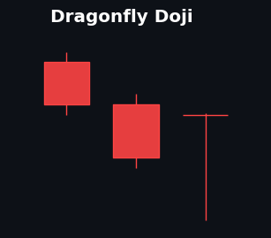

**Detection Logic:**
- Body < 10% of total range
- Upper shadow < 10% of total range
- Lower shadow > 2× body size

**Confluence Requirements:**
- Price at or below Bollinger Lower Band
- RSI < 35 (oversold)
- Volume above average
- Reversal context

---

### Bullish Belt Hold


A strong reversal candle that opens at its low and closes near its high.


**Detection Logic:**
- Open = Low (within 0.1%)
- Body > 60% of total range
- Bullish (green) candle

**Confluence Requirements:**
- Price below EMA 50 (reversal opportunity)
- Volume > 120% of SMA
- RSI < 45

---

### Bullish Marubozu


A full-bodied bullish candle with minimal shadows, showing strong conviction.

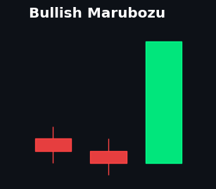

**Detection Logic:**
- Body > 80% of total range
- Minimal upper and lower shadows
- Bullish (green) candle

**Confluence Requirements:**
- Price above EMA 50 (trend confirmation)
- Volume expansion

---

## Two-Candle Patterns


### Bullish Engulfing


A reversal pattern where a bullish candle completely engulfs the previous bearish candle.

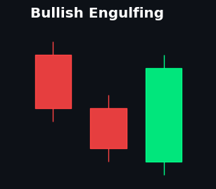

**Detection Logic:**
- Day 1: Bearish candle
- Day 2: Bullish candle
- Day 2 body completely covers Day 1 body

**Confluence Requirements:**
- Momentum oversold (RSI < 45)
- Volume expansion

---

### Bullish Harami


An inside bar pattern where a small bullish candle forms within a large bearish candle.

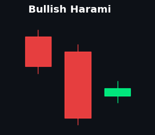

**Detection Logic:**
- Day 1: Large bearish candle
- Day 2: Small bullish candle
- Day 2 body < 50% of Day 1 body
- Day 2 completely inside Day 1 body range

**Confluence Requirements:**
- RSI < 40 (near oversold)
- MFI < 30 (money flow oversold)
- Reversal context

---

### Bullish Kicker


A powerful gap reversal pattern with extreme conviction.

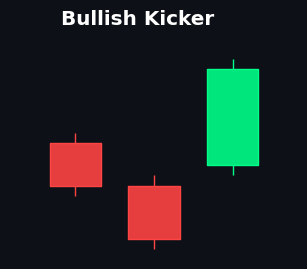

**Detection Logic:**
- Day 1: Bearish candle
- Day 2: Bullish candle with gap up (Open > Day 1 Open)
- Move > 1 ATR from Day 1 close
- True gap preferred (Day 2 Low > Day 1 High)

**Confluence Requirements:**
- Volume > 200% of previous day (extreme conviction)
- RSI momentum shift

---

### Piercing Line


A two-bar reversal where the bullish candle closes above the midpoint of the previous bearish candle.

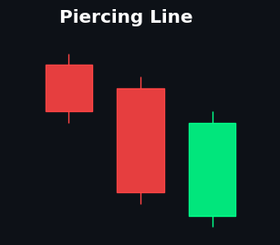

**Detection Logic:**
- Day 1: Large bearish candle (body > 60% range)
- Day 2: Gap down open (below Day 1 close)
- Day 2 closes above midpoint of Day 1 body
- Day 2 closes below Day 1 open

**Confluence Requirements:**
- Momentum oversold
- Volume expansion

---

### Tweezer Bottoms


Two consecutive candles with matching lows, indicating strong support.

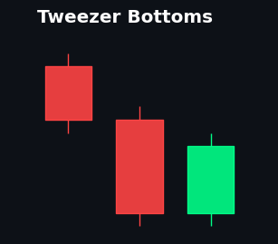

**Detection Logic:**
- Matching lows (within 0.1% variance)
- RSI < 35 (oversold)
- Price below 20-period EMA (downtrend context)
- Day 2 is bullish

**Confluence Requirements:**
- RSI < 35
- Volume expansion
- Reversal context

---

## Three-Candle Patterns


### Morning Star


A powerful three-bar reversal pattern with a small "star" candle in the middle.

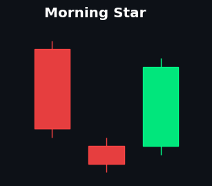

**Detection Logic:**
- Day 1: Large bearish candle (body > ATR)
- Day 2: Small body (< 30% of range), gap down from Day 1
- Day 3: Bullish, closes > midpoint of Day 1 body (50% penetration)

**Conviction Score (0.0 - 1.0):**
| Modifier | Score |
|----------|-------|
| Base pattern | +0.3 |
| Volume escalation (Vol3 > Vol2 > Vol1) | +0.2 |
| Abandoned Baby (true gaps) | +0.3 |
| RSI < 35 in last 3 periods | +0.2 |

**Special Sub-Pattern: Bullish Abandoned Baby**
- Requires true gaps on both sides of the star
- Gap 1: Day 1 Low > Day 2 High
- Gap 2: Day 2 High < Day 3 Low
- Stored in `is_abandoned_baby` column

---

### Three White Soldiers


Three consecutive large bullish candles, each opening within the previous body.

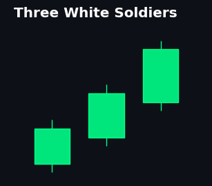

**Detection Logic:**
- Three consecutive bullish candles
- Each opens within previous candle's body
- Each closes higher than previous close
- Large bodies (> 60% of range)

**Confluence Requirements:**
- Reversal context
- Volume expansion

---

### Three Inside Up


A three-bar pattern: bearish, inside bullish (harami), confirmation.

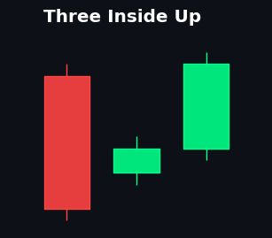

**Detection Logic:**
- Day 1: Large bearish candle
- Day 2: Bullish harami (inside Day 1's body)
- Day 3: Bullish confirmation closing above Day 1's open

**Confluence Requirements:**
- Volume escalation (Vol3 > Vol2 > Vol1)
- RSI rising from oversold
- Reversal context

---

### Rising Three Methods


A five-bar continuation pattern with three small consolidation candles.

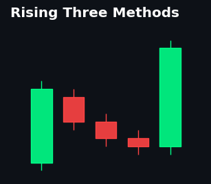

**Detection Logic:**
- Day 1: Large bullish candle (trend candle)
- Days 2-4: Three small candles within Day 1's range
- Day 5: Large bullish candle closing above Day 1's high

**Confluence Requirements:**
- Price above EMA 50 (uptrend confirmation)
- Volume: Lower on consolidation, higher on breakout
- Large bodies for Day 1 and Day 5 (> 1.5× average consolidation body)

---

## Multi-Day Chart Patterns


### Bull Flag


A continuation pattern with a strong uptrend followed by consolidation.

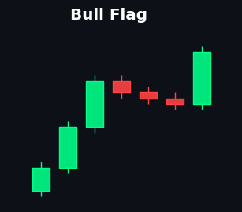

**Detection Logic:**
- Flagpole: Rising prices over 5-20 periods
- Flag: Consolidation with lower/equal highs
- Breakout: Close above flag resistance

**Pattern-Specific Exits:**
- TP1 = Entry + 50% of flagpole height
- TP2 = Entry + 100% of flagpole height
- SL = Flag consolidation low × 0.99

---

### Double Bottom


A reversal pattern with two similar lows and a middle peak (neckline).

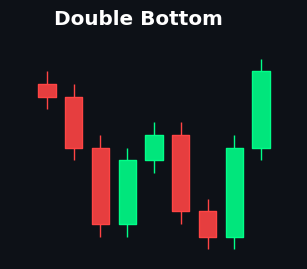

**Detection Logic:**
- Two bottoms within 1.5% of each other
- Bottoms separated by 10-25 periods
- Middle peak (neckline) ≥ 3% above average of bottoms

**Confluence Requirements:**
- Reversal context
- Volume expansion on breakout
- Volatility contraction

---

### Cup and Handle


A bullish continuation pattern resembling a teacup with a handle.

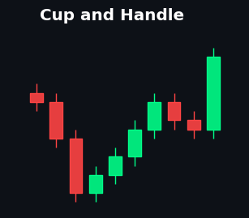

**Detection Logic:**
- Cup: U-shaped bottom (not V-shaped)
  - Retracement: 30-50% from left rim
  - Duration: 20-30 periods
  - Rounded bottom (low variance in rolling min)
- Handle: 4-7 period consolidation in top 10% of cup height
- Recovery: Right rim within 5% of left rim high

**Confluence Requirements:**
- Price above EMA 50 (uptrend)
- Volume expansion on breakout (> 150% SMA)
- Volatility contraction

---

### Ascending Triangle


A continuation pattern with flat resistance and rising support.

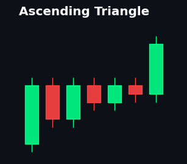

**Detection Logic:**
- Flat upper resistance (≤ 0.5% variance over 14 periods)
- Rising support (positive slope via linear regression)
- Lookback: 14-20 periods

**Confluence Requirements:**
- Price above EMA 50 (bullish trend)
- Volume expansion on breakout (> 150% SMA)
- Volatility contraction

---

### Falling Wedge


A bullish pattern with converging, downward-sloping trendlines.

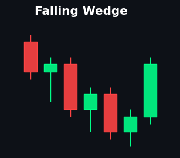

**Detection Logic:**
- Both high and low slopes negative (falling)
- High slope > low slope (converging/narrowing)
- Breakout: Close above recent high
- Lookback: 20 periods for regression

**Confluence Requirements:**
- Volume expansion on breakout (> 150% SMA)
- Volatility contraction (ATR declining)

---

### Inverse Head and Shoulders


A powerful reversal pattern with three troughs.

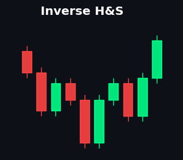

**Detection Logic:**
- Left Shoulder: Local low (periods -30 to -20)
- Head: Lower low than both shoulders (periods -20 to -10)
- Right Shoulder: Higher low than head, ~similar to left (periods -10 to -1)
- Shoulder symmetry: Within 10% of each other
- Neckline: Max high between shoulders
- Breakout: Close above neckline

**Confluence Requirements:**
- Volume: Decreasing on head, increasing on right shoulder
- Volume expansion on breakout (> 150% SMA)

---

## Confluence Factors

All patterns require validation through multiple confluence filters to improve signal quality.

### Regime Filters

| Filter | Condition | Purpose |
|--------|-----------|---------|
| **Trend Bullish** | Close > EMA 50 | Continuation patterns |
| **Momentum Oversold** | RSI < 45 | Reversal patterns |
| **RSI Divergence** | Price makes lower low, RSI makes higher low | Strong reversal signal |
| **Volatility Contraction** | ATR < SMA(ATR, 20) | VCP-style compression |
| **Volume Expansion** | Volume > 120% of SMA(20) | Confirmation of interest |

### Pattern-Specific Confluence

| Pattern Type | Required Confluence |
|--------------|---------------------|
| Reversal (single-candle) | RSI divergence OR momentum oversold + volume expansion |
| Reversal (multi-candle) | Volume escalation + reversal context |
| Continuation | Trend bullish + volume expansion |
| Breakout (chart patterns) | Volume > 150% SMA + volatility contraction |

---

## Signal Quality Filters

After pattern detection, signals pass through additional quality filters:

### Volume Confirmation Filter
**Applies to:** Ascending Triangle, Cup and Handle, Falling Wedge, Inverse H&S

Breakout patterns require volume ≥ 150% of the 20-period SMA to confirm genuine breakouts and filter fakeouts.

### Risk-to-Reward Filter
**Applies to:** All signals

Signals with R:R ratio < 1.5 are automatically rejected:

```
R:R = (Take Profit 1 - Entry) / (Entry - Stop Loss)
```

If R:R < 1.5, the signal is discarded with a warning log.

---

## Pattern Detection Performance

All pattern detection uses **vectorized pandas operations** with no loops, ensuring high performance:

- Uses `pd.Series` boolean operations
- Leverages `df.shift()` for multi-candle comparisons
- Rolling windows for chart pattern detection
- Linear regression via `np.polyfit()` for trendline slopes

---

## Implementation Files

| File | Purpose |
|------|---------|
| `src/crypto_signals/analysis/patterns.py` | Pattern detection logic |
| `src/crypto_signals/engine/signal_generator.py` | Signal generation and filtering |
| `src/crypto_signals/analysis/indicators.py` | Technical indicator calculations |
| `tests/analysis/test_patterns.py` | Pattern unit tests |
