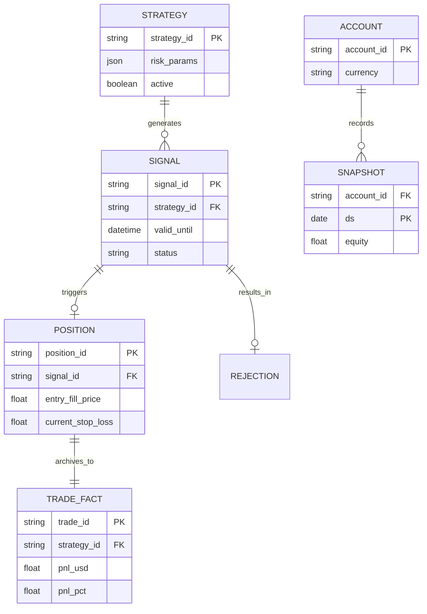

# Data Architecture & Schemas

**Current State: January 2026**

This document outlines the high-level data flow and storage schema for Crypto Sentinel.

> [!IMPORTANT]
> **Source of Truth**: All detailed field definitions are now consolidated in the [Data Handbook](../data/00_data_handbook.md).

---

## 1. System Entity Relationship (Hot-to-Cold)

The following diagram illustrates the lifecycle of a trading signal from detection to analytical archival.

---

## 2. Architecture Overview

1.  **Hot Storage (Firestore)**: Operational database for real-time signaling and trade management.
2.  **Cold Storage (BigQuery)**: Analytical warehouse for backtesting, performance metrics, and account snapshots.
3.  **Pipelines**: Python-based ETL jobs that move data from Hot to Cold storage daily.

---

## 3. Storage Layer Details

### Hot Storage (Firestore)
**Project**: `{{PROJECT_ID}}`

| Collection | Description | Target handbook |
| :--- | :--- | :--- |
| **dim_strategies** | Configuration for trading strategies. | [Handbook §3.A](../data/00_data_handbook.md#a-operational-storage-firestore-hot) |
| **live_signals** | Ephemeral trading opportunities. | [Handbook §4.Signal](../data/00_data_handbook.md#live-signal-live_signals) |
| **live_positions** | Active trades managed by the bot. | [Handbook §3.A](../data/00_data_handbook.md#a-operational-storage-firestore-hot) |

### Cold Storage (BigQuery)
**Dataset**: `{{PROJECT_ID}}.crypto_analytics`

| Table Name | Type | Key Columns | Target Handbook |
| :--- | :--- | :--- | :--- |
| **fact_trades** | FACT | `trade_id`, `pnl_usd`, `pnl_pct` | [Handbook §4.Trade](../data/00_data_handbook.md#trade-execution-fact_trades) |
| **snapshot_accounts** | SNAPSHOT | `account_id`, `equity`, `ds` | [Handbook §4.Account](../data/00_data_handbook.md#account-snapshot-snapshot_accounts) |

---

## 4. Data Flow

1.  **Trade Archival Pipeline**:
    *   **Source**: `live_positions` (Firestore) where `status = CLOSED`.
    *   **Enrich**: Alpaca API (Exact Fill Times, Fees).
    *   **Target**: `fact_trades` (BigQuery).

2.  **Account Snapshot Pipeline**:
    *   **Source**: Alpaca API (Account State, Portfolio History).
    *   **Target**: `snapshot_accounts` (BigQuery).

3.  **Strategy Performance** (Planned):
    *   **Source**: `fact_trades`.
    *   **Target**: `summary_strategy_performance`.
