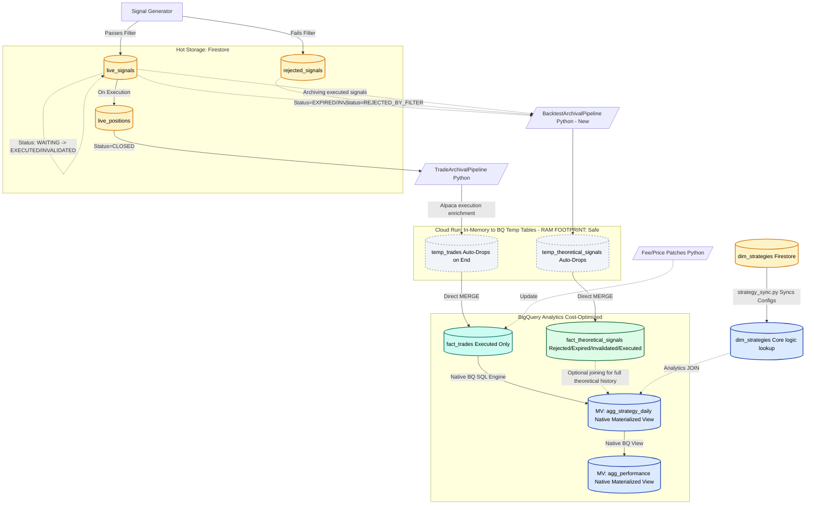

# Lean Analytics System Architecture (PROPOSED)

## Vision & Architecture Roadmap

The following diagram maps the proposed **Lean Architecture** for the signal lifecycle. It drastically simplifies the BigQuery footprint (reducing tables from 28 to 8), guarantees idempotency via Temp Tables, and strictly separates **Actual Executions** from **Theoretical Signals** to power a clean Backtesting Engine.

## Key Improvements Addressed

1. **The Staging Bloat Eradicated**: Notice that the `stg_*` tables are gone. They are replaced by the `Memory JSON -> BQ TEMP TABLE` blocks (dashed gray). The pipeline uses transient Temp Tables to perform the `MERGE` and drops them instantly. Zero duplicate rows, zero UI clutter.
2. **The `INVALIDATED` Orphan Gap Fixed**: The dashed green line shows `INVALIDATED` signals now correctly mapping into the archival pipeline rather than rotting in Firestore.
3. **The `fact_theoretical_signals` Super-Table**: We've collapsed `fact_rejected`, `fact_expired`, and `fact_invalidated` into a single, unified backtesting repository (`fact_theoretical_signals` - highlighted in green). This lets your Backtesting Engine trivially query *"Show me all signals that failed gate criteria across all strategies."*
4. **Native BigQuery Views**: The orange / dark blue `agg_strategy_daily` and `summary_strategy_performance` logic has been moved *into* BigQuery as Native Views. We delete `agg_strategy_daily.py` and `performance.py` entirely, preventing the "round-tripping" anti-pattern where data leaves BQ just to be aggregated and shoved back in.
5. **Real Separation of Concerns**: We have rigorously separated `fact_trades` (your literal money/Alpaca performance) from your theoretical data. You will no longer risk "paper" metrics polluting your real win rates.
