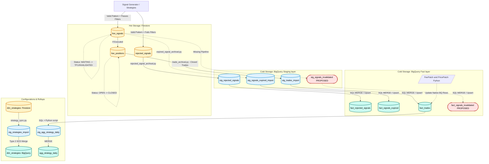
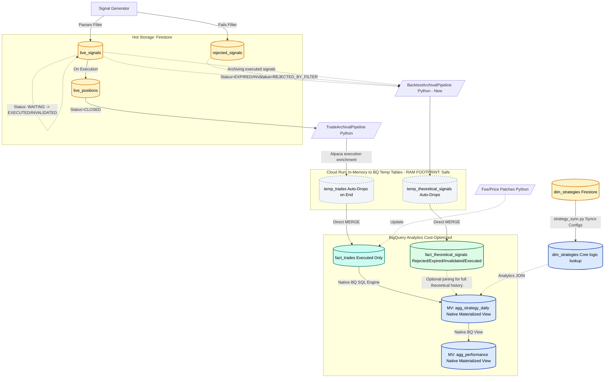

# Signal Lifecycle Architecture & Analytics System

This document maps the total lifecycle of a trading signal generated by the Crypto Sentinel system, illustrating exactly how data flows from operational **Hot Storage (Firestore)** to analytical **Cold Storage (BigQuery)**. It contrasts the Current Architecture (which contains identified data gaps and anti-patterns) with the proposed Lean Architecture Vision.

---

## 1. The Current Architecture

The existing Crypto Sentinel analytics backend is characterized by fragmented data silos, heavy reliance on persistent staging tables, and Python-driven analytical rollups. Below is a detailed mapping of the current operational flow:

### Data Generation (The Hot Path)
- **Signal Generation (`signal_generator.py`)**: Continuously analyzes market data (candles, volume) to detect geometric patterns and technical confluence (RSI, ADX). It generates a rich `Signal` Pydantic model.
	- If a signal passes safety/quality gates, it is saved to the Firestore `live_signals` collection.
	- If a signal fails a quality gate (e.g., poor volume), an identical "shadow" signal is generated and saved directly to the Firestore `rejected_signals` collection.
- **Trade Execution (`execution.py`)**: When a valid `live_signal` is executed via Alpaca, a `Position` model is generated and saved to the Firestore `live_positions` collection.

### Archival Pipelines (The Move to Cold Storage)
Every night (`T-0`), Jenkins/Cloud Run executes a suite of Python pipelines to extract data from the Firestore hot storage and insert it into BigQuery:
- **`trade_archival.py`**: Queries Firestore for `CLOSED` records in `live_positions`. It extracts these into a Pydantic `TradeExecution` schema. *Crucially, it does not fetch the parent `live_signal`.* The `live_signal` remains in Firestore until a 30-day GCP TTL deletes it. The pipeline truncates `stg_trades_import`, inserts the records, and issues a `MERGE` SQL statement into the persistent `fact_trades` table.
- **`rejected_signal_archival.py`**: Queries Firestore for records in `rejected_signals`, loads them into `stg_rejected_signals`, and issues a `MERGE` into `fact_rejected_signals`.
- **`expired_signal_archival.py`**: Queries `live_signals` directly for records marked `EXPIRED`, loads them into `stg_signals_expired_import`, and issues a `MERGE` into `fact_signals_expired`.
- **Unaccounted State**: Signals marked as `INVALIDATED` currently have no archival pipeline and are silently deleted by TTL.

### Financial Reconciliation (Asynchronous Patching)
Because broker fees and final fill prices are often asynchronous:
- **`fee_patch.py`**: Queries the Alpaca API for actual realized fees (CFEE) on trades closed > 24 hours ago. It runs an `UPDATE` statement directly against BigQuery's `fact_trades` to replace estimated fees.
- **`price_patch.py`**: Heals missing exit prices directly via SQL `UPDATE` against `fact_trades`.

### Analytical Rollups (The Anti-Pattern Loop)
- **`agg_strategy_daily.py`**: Connects to BigQuery, runs a `GROUP BY` query on `fact_trades` to summarize daily performance, pulls the result out into Python memory, pushes it to `stg_agg_strategy_daily`, and issues a `MERGE` into `agg_strategy_daily`.
- **`performance.py`**: Reads `agg_strategy_daily` into Python, calculates win rates and portfolio drawdowns, and pushes the final dataframe to `stg_performance_import` before merging into `summary_strategy_performance`.

### Current Architecture Diagram

---

## 2. The Lean Architecture Vision (Proposed)

The proposed Lean Architecture radically simplifies the GCP footprint by leaning aggressively into Native BigQuery operations, eliminating redundant staging tables, and consolidating the data structures to support accurate quantitative backtesting.

### Unified Theoretical Backtesting Storage
Instead of sharding signals into four tables (`rejected`, `expired`, `executed`, `invalidated`), the Lean Architecture mandates two primary Fact tables:
- **`fact_trades`**: The immutable financial ledger. Strictly adhering to the `TradeExecution` Pydantic model (PnL, Fees, Alpaca Order IDs, Slippage). It does not contain strategy indicators.
- **`fact_theoretical_signals`**: The backtesting super-table. This table captures the complete `Signal` Pydantic structure natively generated by `signal_generator.py`, including the `confluence_snapshot` (RSI, ADX, SMA flags, Volume metrics) and harmonic structural arrays.
	- Every `REJECTED`, `EXPIRED`, `INVALIDATED`, and **`EXECUTED/CLOSED`** signal will be archived here.
	- This creates a massive, singular dataset for analysts to query true market history without survivorship bias or multi-table `UNION` joins. Reconciling financial performance with technical indicators is a simple `JOIN` between `fact_trades.trade_id` and `fact_theoretical_signals.signal_id`.

### Radical Virtualization (Temp Tables)
We will eradicate the 14+ persistent `stg_` tables currently cluttering BigQuery.
- The base `BigQueryPipelineBase` Python framework will be refactored. Instead of using `client.load_table_from_json()` targeting a persistent `dataset.stg_table`, the pipeline will build a `CREATE TEMP TABLE stg_temp AS ...` SQL injection payload dynamically.
- The Python runner holds the batch JSON strictly in memory (costing ~1MB for 1,000 signals, which is 0.2% of a standard Cloud Run instance limit).
- The pipeline executes the TEMP TABLE creation and the production `MERGE` inside a single Python/BigQuery session context. When the pipeline disconnects, BigQuery automatically drops the RAM-based temporary table. The tables physically disappear to the outside observer, ensuring perfect hygiene.

### Strategy Configuration Linking (SCD Enforcement)
- `dim_strategies` is synced from Firestore to BigQuery exactly as it is today.
- However, the `SignalGenerator` in Python will dynamically pull active IDs from `dim_strategies`. Currently, trades are associated with a hardcoded `pattern_name` (e.g. "bullish_engulfing"). Going forward, they will be associated with the UUID `strategy_id` defined by the Operations team in Firestore. This guarantees that BigQuery relationships never fall back to `"UNKNOWN"`.

### Pure SQL Native Rollups
We will delete the `agg_strategy_daily.py` and `performance.py` Python pipelines completely from the repository.
- Analytics generation belongs in the data warehouse. We will create two Native BigQuery objects:
	- `CREATE VIEW agg_strategy_daily AS ( ... )`
	- `CREATE MATERIALIZED VIEW summary_strategy_performance AS ( ... )`
- These views natively read straight from `fact_trades` and `dim_strategies`. They update instantaneously without consuming Python compute overhead, zeroing out external failure domains and data "round-tripping" latency.

### Lean Architecture Diagram

