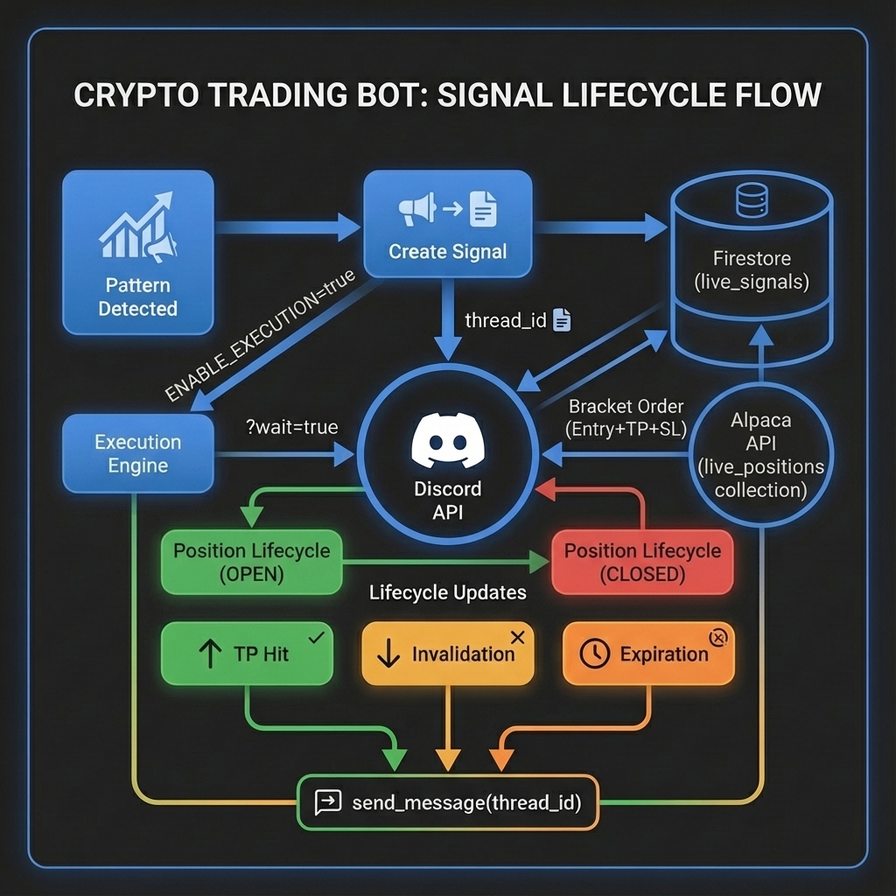

# Discord Threaded Signal Lifecycle

All signal lifecycle updates (TP hits, invalidations, expirations) are pinned to a single Discord thread.

## Architecture



## How It Works

### Thread Creation

1. `discord.send_signal()` is called with `?wait=true` to get the message ID
2. The message ID serves as the `thread_id` for Forum channels
3. This `thread_id` is saved to `signal.discord_thread_id`
4. The signal (with thread_id) is persisted to Firestore

### Lifecycle Updates

1. Signal is fetched from Firestore (includes `discord_thread_id`)
2. `discord.send_message()` is called with `thread_id=signal.discord_thread_id`
3. Discord routes the message to the existing thread using `?thread_id=`

### Self-Healing

If a signal lacks a `discord_thread_id` (due to initial notification failure):
1. System detects the missing thread_id during validation
2. A new thread is created via `discord.send_signal()`
3. The new thread_id is persisted for future updates

## Schema Fields

| Model | Field | Description |
|-------|-------|-------------|
| `Signal` | `discord_thread_id` | Links lifecycle updates to original broadcast |
| `Position` | `discord_thread_id` | Inherited from Signal on fill |
| `TradeExecution` | `discord_thread_id` | Propagated during archival for analytics |

## Visual Testing

```powershell
# Set webhook in .env
TEST_DISCORD_WEBHOOK=https://discord.com/api/webhooks/...

# Run tests
python scripts/visual_discord_test.py success      # Signal → TP1 → TP2 → TP3
python scripts/visual_discord_test.py invalidation # Signal → Invalidation
python scripts/visual_discord_test.py expiration   # Signal → Expiration
python scripts/visual_discord_test.py all          # All paths
```

| Path | Messages | Flow |
|------|----------|------|
| **Success** | 4 | Initial → TP1 → TP2 → TP3 |
| **Invalidation** | 2 | Initial → Invalidation |
| **Expiration** | 2 | Initial → Expiration |
