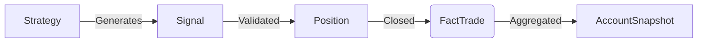

# Data Flow Master Plan & Architecture Strategy

## 1. Conceptual Data Model
*High-level representation of entities and relationships.*

### Core Entities
1.  **Strategy**: The "Brain". Versioned logic (Factors, Filters, Risk Params) that generates trade ideas.
2.  **Signal**: A "Potential Trade". Created by a Strategy, lives in Hot Storage, has a validity window.
3.  **Position**: An "Active Trade". Managed by the Execution Engine, synced with Broker (Alpaca).
4.  **Account**: The "Container". Holds Equity, Cash, and Buying Power. Aggregates performance of all positions.

### The "Golden Thread" Flow

---

## 2. Logical Data Model & Dimensional Design
*Design patterns and schema decisions.*

### Dimensional Modeling Strategy
We utilize a **Star Schema** variant optimized for BigQuery (Columnar Store):
*   **Fact Tables**: `fact_trades`, `fact_rejected_signals`, `fact_signals_expired`, `snapshot_accounts`.
*   **Dimension Tables**: `dim_strategies`, `dim_assets` (Planned).

### Grain Definitions
1.  **Transactional Grain**: `fact_trades`. Each record is a single closed trade.
2.  **Periodic Grain**: `snapshot_accounts`. Daily snapshot of account equity/margin.
3.  **Snapshot Grain**: `fact_signals_expired`. State of a signal at the moment it expired.

### Design Patterns
*   **SCD Type 2 (Slowly Changing Dimensions)**: Applied to `dim_strategies`.
    *   *Mechanism*: When a strategy config changes, we insert a new row with `valid_from` and `valid_to` timestamps. Use the `git_hash` purely as metadata.
    *   *Purpose*: Allows us to replay history against the *exact* strategy version active at that time.
*   **Degenerate Dimensions**: `rejection_reason` in `fact_rejected_signals`. Stored directly in the fact table for query speed.
*   **Junk Dimensions**: Not currently used; leveraging BigQuery `STRUCT` / `JSON` for low-cardinality flags if needed.
*   **Role-Playing Dimensions**: `ds` (Date) serves as `entry_date`, `exit_date`, and `partition_date`.

---

## 3. Physical Data Model (Implementation)
*See `docs/data/00_data_catalog.md` for the exhaustive field list.*

### Storage Tiers
*   **Hot Storage (Firestore)**:
    *   *Latency*: Real-time (ms).
    *   *Use Case*: Live Trading state, Deduplication (`signal_id`), Job Locks.
    *   *TTL*: Short (30 days).
*   **Cold Storage (BigQuery)**:
    *   *Latency*: Batch / Analytical (seconds).
    *   *Use Case*: Backtesting, Performance Reporting, Audit Log.
    *   *Partitioning*: Time-unit partitioning by `ds` (Date).

---

## 4. Requirements & Scope (Gap Analysis)

### Business Objectives
*   **Primary**: Generate trade signals -> Execute on Alpaca Paper -> Evaluate Performance.
*   **Secondary**: Evaluate "Shadow" Performance (Rejected Signals) to tune filters.

### Latency Requirements
*   **Crypto**: Near Real-time (1D Candles = Batch processing is acceptable, but signal generation needs to be fast relative to candle close).
*   **Equities**: Planned (Same 1D Batch).

### Data Volume Estimates
*   **Current**: 1 Account, ~10 Assets, Daily Batch. (Low Volume).
*   **Future**: 100s of Assets, Permutations of Strategies. (Exponential Growth).
*   **Constraint**: BigQuery costs scale with query size -> **Partitioning is Critical**.

### Orchestration
*   **ETL vs ELT**:
    *   We use **ETL** (Extract-Transform-Load) via Pydantic Models (`SchemaGuardian`).
    *   *Reason*: We need strict type safety *before* data hits the warehouse to prevent "Garbage In".
    *   *Flow*: Firestore (Extract) -> Pydantic Model (Transform/Validate) -> BigQuery (Load).
