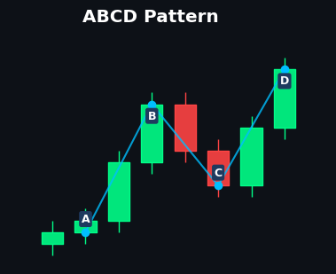
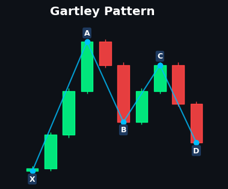
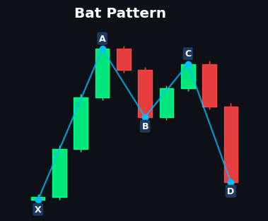
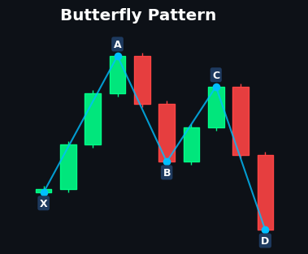
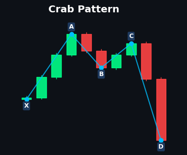
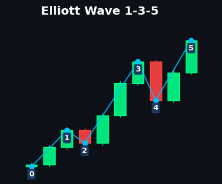

# Pattern Reference Guide

This document provides a comprehensive reference for all bullish candlestick patterns and chart patterns detected by the Sentinel Trader signal engine.

## Table of Contents

- [Pattern Overview](#pattern-overview)
- [Single-Candle Patterns](#single-candle-patterns)
- [Two-Candle Patterns](#two-candle-patterns)
- [Three-Candle Patterns](#three-candle-patterns)
- [Multi-Day Chart Patterns](#multi-day-chart-patterns)
- [Harmonic Patterns](#harmonic-patterns)
- [Confluence Factors](#confluence-factors)
- [Signal Quality Filters](#signal-quality-filters)

---

## Pattern Overview

The signal engine detects **28 patterns** organized into five categories based on their formation duration and complexity.

| Category | Pattern Count | Detection Method |
|----------|---------------|------------------|
| Single-Candle | 5 | Shape analysis |
| Two-Candle | 5 | Sequential comparison |
| Three+ Candle | 4 | Multi-bar validation |
| Multi-Day Chart | 6 | Geometric/structural |
| Harmonic/Fibonacci | 6 | Fibonacci ratio matching |

All patterns use **vectorized pandas operations** for high performance processing on large datasets.

---

## Single-Candle Patterns


### Bullish Hammer


A reversal pattern that forms at the bottom of a downtrend, signaling potential buying pressure.


**Detection Logic:**
- Lower wick ≥ 2× body size
- Upper wick < 30% of total range
- Body in upper 30% of candle range

**Confluence Requirements:**
- RSI < 45 (oversold-ish)
- Volume > 120% of 20-period SMA
- Volatility contraction (ATR < SMA)
- RSI bullish divergence OR price below EMA 50

---

### Inverted Hammer


A bullish reversal pattern with a long upper shadow, indicating failed selling pressure.


**Detection Logic:**
- Upper wick ≥ 2× body size
- Lower wick < 30% of total range
- Body in lower 30% of candle range

**Confluence Requirements:**
- Reversal context (RSI divergence OR momentum oversold)
- Volume expansion (> 120% SMA)
- Volatility contraction

---

### Dragonfly Doji


A powerful single-bar reversal where price opens and closes near the high.


**Detection Logic:**
- Body < 10% of total range
- Upper shadow < 10% of total range
- Lower shadow > 2× body size

**Confluence Requirements:**
- Price at or below Bollinger Lower Band
- RSI < 35 (oversold)
- Volume above average
- Reversal context

---

### Bullish Belt Hold


A strong reversal candle that opens at its low and closes near its high.


**Detection Logic:**
- Open = Low (within 0.1%)
- Body > 60% of total range
- Bullish (green) candle

**Confluence Requirements:**
- Price below EMA 50 (reversal opportunity)
- Volume > 120% of SMA
- RSI < 45

---

### Bullish Marubozu


A full-bodied bullish candle with minimal shadows, showing strong conviction.


**Detection Logic:**
- Body > 80% of total range
- Minimal upper and lower shadows
- Bullish (green) candle

**Confluence Requirements:**
- Price above EMA 50 (trend confirmation)
- Volume expansion

---

## Two-Candle Patterns


### Bullish Engulfing


A reversal pattern where a bullish candle completely engulfs the previous bearish candle.


**Detection Logic:**
- Day 1: Bearish candle
- Day 2: Bullish candle
- Day 2 body completely covers Day 1 body

**Confluence Requirements:**
- Momentum oversold (RSI < 45)
- Volume expansion

---

### Bullish Harami


An inside bar pattern where a small bullish candle forms within a large bearish candle.


**Detection Logic:**
- Day 1: Large bearish candle
- Day 2: Small bullish candle
- Day 2 body < 50% of Day 1 body
- Day 2 completely inside Day 1 body range

**Confluence Requirements:**
- RSI < 40 (near oversold)
- MFI < 30 (money flow oversold)
- Reversal context

---

### Bullish Kicker


A powerful gap reversal pattern with extreme conviction.


**Detection Logic:**
- Day 1: Bearish candle
- Day 2: Bullish candle with gap up (Open > Day 1 Open)
- Move > 1 ATR from Day 1 close
- True gap preferred (Day 2 Low > Day 1 High)

**Confluence Requirements:**
- Volume > 200% of previous day (extreme conviction)
- RSI momentum shift

---

### Piercing Line


A two-bar reversal where the bullish candle closes above the midpoint of the previous bearish candle.


**Detection Logic:**
- Day 1: Large bearish candle (body > 60% range)
- Day 2: Gap down open (below Day 1 close)
- Day 2 closes above midpoint of Day 1 body
- Day 2 closes below Day 1 open

**Confluence Requirements:**
- Momentum oversold
- Volume expansion

---

### Tweezer Bottoms


Two consecutive candles with matching lows, indicating strong support.


**Detection Logic:**
- Matching lows (within 0.1% variance)
- RSI < 35 (oversold)
- Price below 20-period EMA (downtrend context)
- Day 2 is bullish

**Confluence Requirements:**
- RSI < 35
- Volume expansion
- Reversal context

---

## Three-Candle Patterns


### Morning Star


A powerful three-bar reversal pattern with a small "star" candle in the middle.


**Detection Logic:**
- Day 1: Large bearish candle (body > ATR)
- Day 2: Small body (< 30% of range), gap down from Day 1
- Day 3: Bullish, closes > midpoint of Day 1 body (50% penetration)

**Conviction Score (0.0 - 1.0):**
| Modifier | Score |
|----------|-------|
| Base pattern | +0.3 |
| Volume escalation (Vol3 > Vol2 > Vol1) | +0.2 |
| Abandoned Baby (true gaps) | +0.3 |
| RSI < 35 in last 3 periods | +0.2 |

**Special Sub-Pattern: Bullish Abandoned Baby**
- Requires true gaps on both sides of the star
- Gap 1: Day 1 Low > Day 2 High
- Gap 2: Day 2 High < Day 3 Low
- Stored in `is_abandoned_baby` column

---

### Three White Soldiers


Three consecutive large bullish candles, each opening within the previous body.


**Detection Logic:**
- Three consecutive bullish candles
- Each opens within previous candle's body
- Each closes higher than previous close
- Large bodies (> 60% of range)

**Confluence Requirements:**
- Reversal context
- Volume expansion

---

### Three Inside Up


A three-bar pattern: bearish, inside bullish (harami), confirmation.


**Detection Logic:**
- Day 1: Large bearish candle
- Day 2: Bullish harami (inside Day 1's body)
- Day 3: Bullish confirmation closing above Day 1's open

**Confluence Requirements:**
- Volume escalation (Vol3 > Vol2 > Vol1)
- RSI rising from oversold
- Reversal context

---

### Rising Three Methods


A five-bar continuation pattern with three small consolidation candles.


**Detection Logic:**
- Day 1: Large bullish candle (trend candle)
- Days 2-4: Three small candles within Day 1's range
- Day 5: Large bullish candle closing above Day 1's high

**Confluence Requirements:**
- Price above EMA 50 (uptrend confirmation)
- Volume: Lower on consolidation, higher on breakout
- Large bodies for Day 1 and Day 5 (> 1.5× average consolidation body)

---

## Multi-Day Chart Patterns

> [!NOTE]
> **Geometric Structural Foundation**: Multi-day patterns use O(N) ZigZag pivot detection
> (Numba-optimized) rather than fixed lookback windows. Patterns are classified as:
> - **STANDARD_PATTERN**: 5-90 day formations
> - **MACRO_PATTERN**: >90 day formations (displayed with 🏛️ header in Discord)
>
> This allows patterns to be detected regardless of formation length, with accurate
> duration tracking and classification for position sizing context.

### Bull Flag


A continuation pattern with a strong uptrend followed by consolidation.


**Detection Logic (Pivot-Based):**
- Pole Valley → Peak: ≥15% price rise
- Flag consolidation: Stays within top 50% of pole height
- Minimum Pattern Width: At least 10 bars
- Volume Decay: Flag volume < Pole volume
- Breakout: Close ≥ 95% of flag high

**Pattern-Specific Exits:**
- TP1 = Entry + 50% of flagpole height
- TP2 = Entry + 100% of flagpole height
- TP3 = Entry + 150% of flagpole height (runner target)
- SL = Flag consolidation low × 0.99

---

### Double Bottom


A reversal pattern with two similar lows and a middle peak (neckline).


**Detection Logic (Pivot-Based):**
- Two valley pivots (V1, V2) within 1.5% price variance
- Minimum Pattern Width: At least 10 bars between valleys
- Neckline (peak between valleys): ≥3% above average of bottoms

**Confluence Requirements:**
- Reversal context
- Volume expansion on breakout
- Volatility contraction

---

### Cup and Handle


A bullish continuation pattern resembling a teacup with a handle.


**Detection Logic:**
- Cup: U-shaped bottom (not V-shaped)
  - Retracement: 30-50% from left rim
  - Duration: 20-30 periods
  - Rounded bottom (low variance in rolling min)
- Handle: 4-7 period consolidation in top 10% of cup height
- Recovery: Right rim within 5% of left rim high

**Confluence Requirements:**
- Price above EMA 50 (uptrend)
- Volume expansion on breakout (> 150% SMA)
- Volatility contraction

---

### Ascending Triangle


A continuation pattern with flat resistance and rising support.


**Detection Logic (Pivot-Based):**
- Flat Resistance: 2-3 peaks within 2% price variance
- Rising Support: Valley pivots with ascending prices (≥1% slope)
- Minimum Pattern Width: At least 10 bars
- Breakout: Close ≥ 98% of resistance level

**Confluence Requirements:**
- Price above EMA 50 (bullish trend)
- Volume expansion on breakout (> 150% SMA)
- Volatility contraction

---

### Falling Wedge


A bullish pattern with converging, downward-sloping trendlines.


**Detection Logic (Pivot-Based):**
- Lower Highs: Sequential peaks descending in price
- Lower Lows: Sequential valleys descending in price
- Converging: Peak descent rate < Valley descent rate (narrowing)
- Minimum Pattern Width: At least 10 bars
- Breakout: Close above most recent peak

**Confluence Requirements:**
- Volume expansion on breakout (> 150% SMA)
- Volatility contraction (ATR declining)

---

### Inverse Head and Shoulders


A powerful reversal pattern with three troughs.


**Detection Logic (Pivot-Based):**
- 5-pivot structure: V1 (L-Shoulder), P1 (Neckline), V2 (Head), P2 (Neckline), V3 (R-Shoulder)
- Depth Symmetry: V1 and V3 within 3% price variance
- Head Prominence: V2 at least 3% lower than the lowest shoulder
- Time Symmetry: Duration V1→V2 between 60%-140% of V2→V3
- Minimum Pattern Width: At least 10 bars
- Breakout: Close above neckline (lower of P1, P2)

**Confluence Requirements:**
- Volume: Decreasing on head, increasing on right shoulder
- Volume expansion on breakout (> 150% SMA)

---

## Harmonic Patterns (Structural Context)

> [!NOTE]
> **Multi-Layer Architecture: Structural Context**: Harmonic patterns are no longer treated as standalone signals. Instead, they provide **Macro Structural Context** to tactical triggers (like candlestick patterns).
>
> Fibonacci-Based Pattern Recognition uses precise ratios (±0.1% tolerance gate) to identify high-probability reversal zones processed on the most recent 10-15 pivots.
>
> - **MACRO Classification**: Patterns spanning >90 days from X to D point are classified as MACRO_PATTERN for institutional-scale context, conferring up to 120h of signal TTL.
> - **Conviction Generation**: When a tactical pattern (e.g., Bullish Engulfing) occurs simultaneously with a valid Harmonic pattern, the signal is elevated to a `HIGH` conviction tier.


### ABCD Measured Move


A price symmetry pattern where the CD leg mirrors the AB leg in both price and time.



**Detection Logic:**
- Price symmetry: |AB| ≈ |CD| within ±0.1%
- Time symmetry: Time(AB) ≈ Time(CD) within ±0.1%
- Requires 4 consecutive pivots (A, B, C, D)

**Key Characteristics:**
- Measures price projection based on AB move magnitude
- Often appears within larger harmonic structures

---

### Gartley Pattern


The original harmonic pattern with specific Fibonacci retracement ratios.



**Detection Logic:**
- B point: 0.618 retracement of XA leg
- D point: 0.786 retracement of XA leg
- Requires 5 consecutive pivots (X, A, B, C, D)

**Key Ratios:**
| Point | Ratio |
|-------|-------|
| B | 0.618 (±0.1%) |
| D | 0.786 (±0.1%) |

---

### Bat Pattern


A precise harmonic pattern with deep D-point retracement.



**Detection Logic:**
- B point: 0.382-0.500 retracement of XA leg
- D point: 0.886 retracement of XA leg
- Requires 5 consecutive pivots (X, A, B, C, D)

**Key Ratios:**
| Point | Ratio Range |
|-------|-------------|
| B | 0.382-0.500 |
| D | 0.886 (±0.1%) |

---

### Butterfly Pattern


An extension pattern that completes beyond the initial XA leg.



**Detection Logic:**
- B point: 0.786 retracement of XA leg
- D point: 1.270 extension of XA leg
- Requires 5 consecutive pivots (X, A, B, C, D)

**Key Ratios:**
| Point | Ratio |
|-------|-------|
| B | 0.786 (±0.1%) |
| D | 1.270 (±0.1%) |

---

### Crab Pattern


The most extreme harmonic pattern with maximum extension.



**Detection Logic:**
- B point: 0.382-0.618 retracement of XA leg
- D point: 1.618 extension of XA leg
- Requires 5 consecutive pivots (X, A, B, C, D)

**Key Ratios:**
| Point | Ratio Range |
|-------|-------------|
| B | 0.382-0.618 |
| D | 1.618 (±0.1%) |

---

### Elliott Wave (1-3-5)


Impulse wave structure detection based on Elliott Wave theory.



**Detection Logic:**
- Wave 3 must be longer than Wave 1 (strict requirement)
- Wave 4 must not retrace into Wave 1 price territory
- Alternating pivot structure (Valley-Peak-Valley-Peak-Valley or inverse)
- Requires 5 consecutive alternating pivots

**Wave Validation:**
| Rule | Condition |
|------|-----------|
| Wave 3 vs Wave 1 | Wave 3 length > Wave 1 length |
| Wave 4 validity | Wave 4 price above Wave 1 peak (bullish) |

---

## Confluence Factors

All patterns require validation through multiple confluence filters to improve signal quality.

### Regime Filters

| Filter | Condition | Purpose |
|--------|-----------|---------|
| **Trend Bullish** | Close > EMA 50 | Continuation patterns |
| **Momentum Oversold** | RSI < 45 | Reversal patterns |
| **RSI Divergence** | Price makes lower low, RSI makes higher low | Strong reversal signal |
| **Volatility Contraction** | ATR < SMA(ATR, 20) | VCP-style compression |
| **Volume Expansion** | Volume > 120% of SMA(20) | Confirmation of interest |

### Pattern-Specific Confluence

| Pattern Type | Required Confluence |
|--------------|---------------------|
| Reversal (single-candle) | RSI divergence OR momentum oversold + volume expansion |
| Reversal (multi-candle) | Volume escalation + reversal context |
| Continuation | Trend bullish + volume expansion |
| Breakout (chart patterns) | Volume > 150% SMA + volatility contraction |

---

## Signal Quality Filters & Conviction Tiers

After pattern detection, signals pass through Conviction-Aware Quality Gates. The Multi-Layer Signal Architecture allows signals with superior structural context to bypass strict baseline requirements.

### Conviction Tiers
- **HIGH**: Tactical Trigger + Harmonic Structural Context (e.g. Bullish Engulfing formed perfectly at a Gartley D-point).
- **STANDARD**: Tactical Trigger or Chart Pattern with no active harmonic context.

### Volume Confirmation Gate
**Applies to**: Continuation patterns (Ascending Triangle, Bull Flag, etc.) and Reversals.
- **STANDARD Conviction**: Volume ≥ 150% of the 20-period SMA
- **HIGH Conviction**: Volume ≥ 130% of the 20-period SMA (Relaxed threshold)

### Momentum (ADX) Filter
**Applies to**: Trend continuation patterns.
- **STANDARD Conviction**: ADX ≥ 25
- **HIGH Conviction**: ADX ≥ 20 (Relaxed threshold)

### Risk-to-Reward (R:R) Filter
**Applies to**: All signals.

```
R:R = (Take Profit 1 - Entry) / (Entry - Stop Loss)
```

Signals failing the minimum R:R threshold are discarded:
- **STANDARD Conviction**: Minimum R:R = **1.5**
- **HIGH Conviction**: Minimum R:R = **1.2** (Allows taking structurally superior trades even if stop loss placement is wider).

---

## Pattern Detection Performance

All pattern detection uses **vectorized pandas operations** with no loops, ensuring high performance:

- Uses `pd.Series` boolean operations
- Leverages `df.shift()` for multi-candle comparisons
- Rolling windows for chart pattern detection
- Linear regression via `np.polyfit()` for trendline slopes

---

## Implementation Files

| File | Purpose |
|------|---------|
| `src/crypto_signals/analysis/patterns.py` | Candlestick and chart pattern detection |
| `src/crypto_signals/analysis/harmonics.py` | Harmonic/Fibonacci pattern detection |
| `src/crypto_signals/engine/signal_generator.py` | Signal generation and filtering |
| `src/crypto_signals/analysis/indicators.py` | Technical indicator calculations |
| `tests/analysis/test_patterns.py` | Pattern unit tests |
| `tests/analysis/test_harmonics.py` | Harmonic pattern unit tests |
